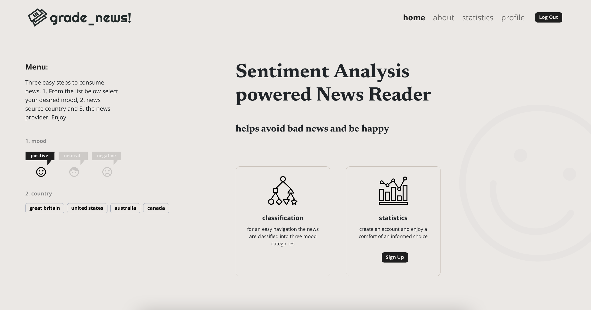

# grade_news!



[Description](#description) | [Motivation](#motivation) | [Run Locally](#runlocally) | [Tech Stack](#techstack) | [Licence](#licence)

## <a name="runlocally">**Description**</a>

## <a name="motivation">**Motivation**</a>

## <a name="runlocally">**Run Locally**</a>

Clone the project

```bash
  git clone https://github.com/kpuwal/Auth0_Hackathon
```

Go to the project directory

```bash
  cd Auth0_Hackathon
```

Install dependencies

```bash
  npm install
```

Create an .env file in root and add your variables. Obtain API keys by creating accounts on [News API](https://newsapi.org) and [Auth0](https://auth0.com). Create local PostgreSQL database.

```
NEWS_URL=
NEWS_API_KEY=

CLIENT_ORIGIN_URL=http://localhost:3000
AUTH0_AUDIENCE=
AUTH0_DOMAIN=

REACT_APP_DOMAIN=
REACT_APP_CLIENT_ID=

REACT_APP_AUTH0_CLIENT_ID=
REACT_APP_CLIENT_ORIGIN_URL=http://localhost:3000
REACT_APP_AUTH0_AUDIENCE=
REACT_APP_AUTH0_DOMAIN=
REACT_APP_SERVER_URL=http://localhost:5000

DB_USER=
DB_PASSWORD=
DB_HOST=localhost
DB_PORT=
DB_DATABASE=
```

Build the app

```bash
  npm run build
```

Start the app

```bash
  npm start
```

## <a name="techstack">**Tech Stack**</a>
- **NodeJS**

- **Express**

- **React**

- **Typescript**

## <a name="licence">**License**</a>

[MIT](LICENSE)